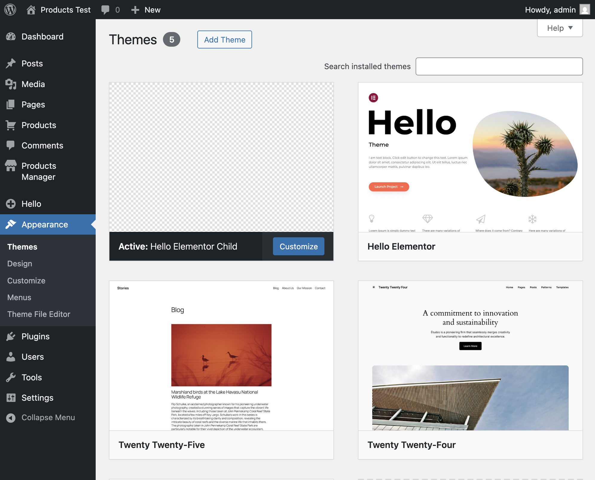
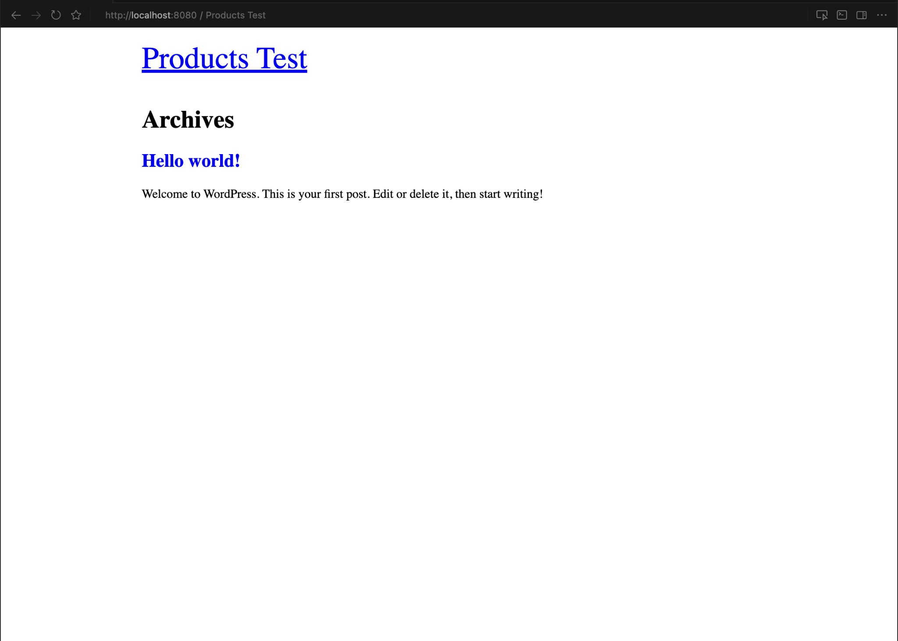
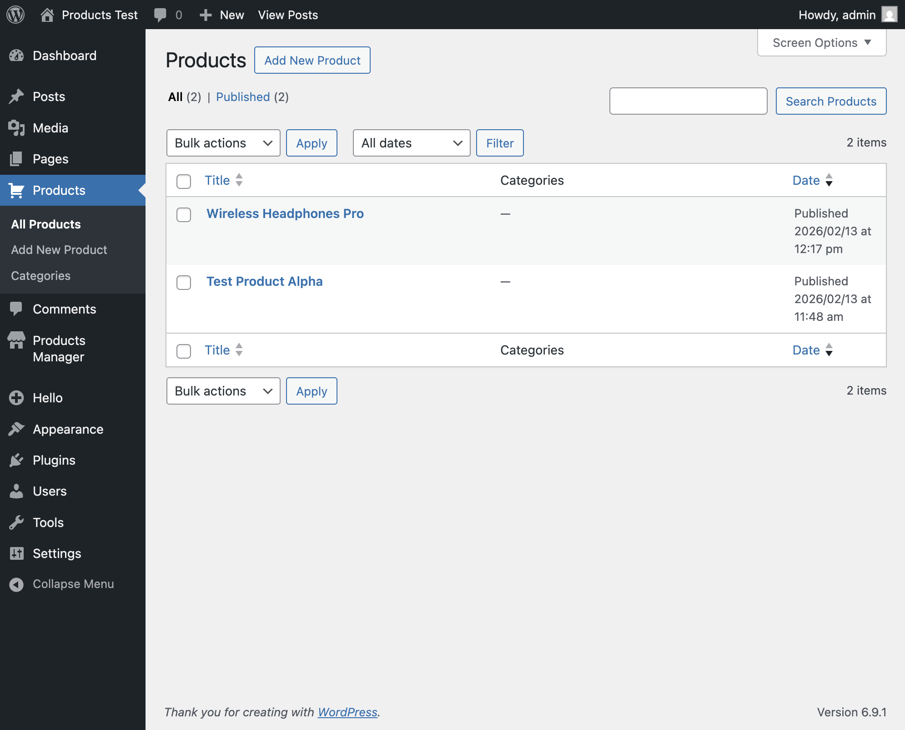
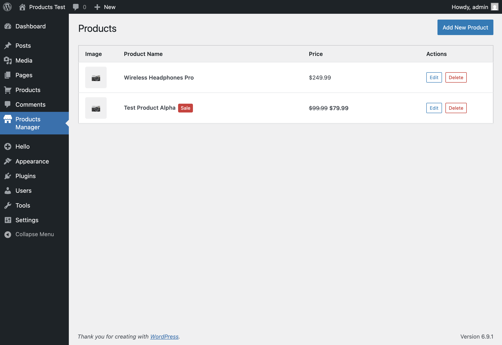
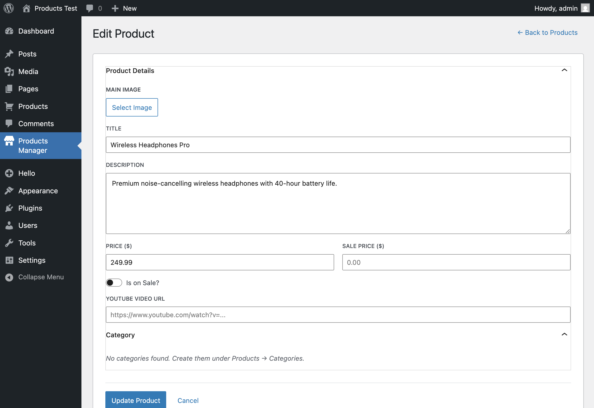

# Hello Elementor Child — Products Manager

A WordPress child theme for **Hello Elementor** that adds a custom **Products** post type, managed entirely through a **React + TypeScript admin app** built with Gutenberg components and the WordPress REST API.

---

## Features

| Part | Description |
|------|-------------|
| **Part 1** | Git repository on GitHub |
| **Part 2** | Child theme for `hello-elementor` |
| **Part 3** | Creates an `editor` user `wp-test` on theme activation; disables admin bar via code |
| **Part 4** | Custom Post Type **Products** + custom taxonomy **Categories** |
| **Part 5** | React/TypeScript settings page with full CRUD via custom REST API (`jeec/v1/`) |
| **Extra** | PHPUnit tests for the REST API endpoints + Jest tests for React components |

---

## Screenshots

### Part 2 — Active Child Theme


### Part 3 — wp-test User (no admin bar)


### Part 4 — Products Custom Post Type


### Part 5 — Products Manager (React App — List)


### Part 5 — Products Manager (React App — Edit Form)


---

## Quick Start (Local Development)

### Prerequisites

- **PHP** ≥ 8.0 (with `mysqli` extension)
- **MariaDB** or **MySQL**
- **Node.js** ≥ 18
- **npm** ≥ 9
- **Composer** (for PHPUnit tests)
- **WordPress** ≥ 6.0 with **Hello Elementor** parent theme installed

### 1. Clone and install dependencies

```bash
# Clone into your WordPress themes directory
cd /path/to/wordpress/wp-content/themes/
git clone <repo-url> hello-elementor-child
cd hello-elementor-child

# Install Node.js dependencies
npm install

# Build the React app
npm run build

# (Optional) Install PHP dependencies for tests
composer install
```

### 2. Activate the theme

1. Go to **Appearance → Themes** in WordPress admin.
2. Activate **Hello Elementor Child**.

> On activation, the `wp-test` editor user is created automatically, with the admin bar disabled for this user. (Password and email — see `inc/user-setup.php`)

### 3. Use the Products Manager

Navigate to **Products Manager** in the WordPress admin sidebar. From there you can:

- View all products in a table (name, thumbnail, price, actions)
- Add a new product
- Edit an existing product
- Delete a product

All operations use the custom REST API — no page reloads.

---

## Development

### Watch mode (hot-reload)

```bash
npm start
```

This runs `wp-scripts start` which watches for file changes and rebuilds automatically.

### Production build

```bash
npm run build
```

### TypeScript type checking

```bash
npm run check-types
```

---

## Running Tests

### React / TypeScript tests (Jest + Testing Library)

```bash
npm test
```

65 tests across 7 suites covering:

- **API layer** — verifies all REST API calls (`getProducts`, `createProduct`, `updateProduct`, `deleteProduct`, `getCategories`)
- **App** — screen routing between list, add, and edit views
- **ProductList** — table rendering, empty state, delete flow, error handling
- **ProductForm** — add/edit modes, form validation, API submission
- **DeleteConfirmModal** — confirmation dialog, button states
- **ImagePicker** — image select/replace/remove, WP Media integration
- **CategorySelector** — checkbox rendering, toggle behavior, accessibility

### PHP Unit tests (PHPUnit + WordPress test suite)

```bash
# 1. Install WordPress test library (one-time setup)
git clone --depth 1 --branch 6.9.1 https://github.com/WordPress/wordpress-develop.git /tmp/wp-develop
mkdir -p /tmp/wordpress-tests-lib
cp -R /tmp/wp-develop/tests/phpunit/includes /tmp/wordpress-tests-lib/
cp -R /tmp/wp-develop/tests/phpunit/data /tmp/wordpress-tests-lib/

# 2. Create wp-tests-config.php at /tmp/wordpress-tests-lib/wp-tests-config.php
#    (see tests/bootstrap.php for required constants)

# 3. Create a test database
mysql -e "CREATE DATABASE IF NOT EXISTS wordpress_test;"

# 4. Install PHP dependencies
composer install

# 5. Run the tests
WP_TESTS_DIR=/tmp/wordpress-tests-lib \
WP_TESTS_PHPUNIT_POLYFILLS_PATH="$(pwd)/vendor/yoast/phpunit-polyfills" \
./vendor/bin/phpunit
```

15 tests covering all custom REST API endpoints: CRUD operations, pagination, meta fields, taxonomy assignment, permission checks (403 for unauthenticated/subscriber users), and 404 handling.

---

## Project Structure

```
hello-elementor-child/
├── style.css                       # Child theme declaration
├── functions.php                   # Main bootstrap – includes all modules
├── inc/
│   ├── user-setup.php              # Part 3 – user creation + admin bar
│   ├── post-types.php              # Part 4 – CPT & taxonomy + meta fields
│   ├── rest-api.php                # Part 5 – Custom REST endpoints
│   └── admin-page.php              # Part 5 – Admin page + script enqueue
├── src/                            # React/TypeScript source
│   ├── index.tsx                   # Entry point
│   ├── App.tsx                     # Root component (screen routing + notices)
│   ├── style.scss                  # Admin app styles (SCSS with variables/nesting)
│   ├── api/
│   │   └── products.ts            # Typed REST API layer
│   ├── components/
│   │   ├── ProductList.tsx         # Products table + delete flow
│   │   ├── ProductForm.tsx         # Add / Edit product form
│   │   ├── ImagePicker.tsx         # WP Media Library integration
│   │   ├── CategorySelector.tsx    # Taxonomy checkboxes
│   │   └── DeleteConfirmModal.tsx  # Confirmation dialog
│   ├── hooks/
│   │   ├── useProducts.ts         # Products data + loading state
│   │   └── useCategories.ts       # Categories data
│   └── types/
│       ├── index.ts               # Domain types (Product, Category, etc.)
│       └── global.d.ts            # WordPress global declarations
├── build/                          # Compiled assets (generated by npm run build)
├── tests/
│   ├── bootstrap.php               # PHPUnit bootstrap
│   └── test-rest-api.php           # REST API unit tests (15 tests)
├── src/**/*.test.{ts,tsx}          # React component tests (65 tests)
├── jest.config.ts                  # Jest configuration
├── tsconfig.json                   # TypeScript configuration
├── phpunit.xml.dist                # PHPUnit configuration
├── composer.json                   # PHP dependencies
├── package.json                    # Node dependencies & scripts
└── README.md
```

---

## REST API Endpoints

All endpoints require authentication (`edit_posts` capability).

| Method | Endpoint | Description |
|--------|----------|-------------|
| `GET` | `/wp-json/jeec/v1/products` | List products (supports `per_page`, `page`, `search`) |
| `POST` | `/wp-json/jeec/v1/products` | Create a product |
| `GET` | `/wp-json/jeec/v1/products/<id>` | Get single product |
| `POST` | `/wp-json/jeec/v1/products/<id>` | Update a product |
| `DELETE` | `/wp-json/jeec/v1/products/<id>` | Delete a product |
| `GET` | `/wp-json/jeec/v1/product-categories` | List product categories |

### Product fields

| Field | Type | Description |
|-------|------|-------------|
| `title` | `string` | Product name |
| `description` | `string` | Product description (HTML) |
| `price` | `number` | Regular price |
| `sale_price` | `number` | Sale price |
| `is_on_sale` | `boolean` | Whether the product is on sale |
| `youtube_video` | `string` | YouTube video URL |
| `featured_image_id` | `integer` | WordPress attachment ID |
| `categories` | `integer[]` | Array of term IDs (`product_category`) |

---

## Tech Stack

- **PHP** — WordPress child theme, custom post types, REST API endpoints
- **TypeScript** — Strict typing for the entire React app
- **React** — UI via `@wordpress/element`
- **Gutenberg Components** — `@wordpress/components` as the design system
- **SCSS** — Styles with variables, nesting, BEM
- **Jest + Testing Library** — React component & API tests
- **PHPUnit** — WordPress REST API integration tests

---

## npm Scripts

| Script | Description |
|--------|-------------|
| `npm run build` | Production build of the React app |
| `npm start` | Watch mode with hot-reload |
| `npm test` | Run React/TypeScript unit tests |
| `npm run test:watch` | Run tests in watch mode |
| `npm run test:coverage` | Run tests with coverage report |
| `npm run check-types` | TypeScript type checking (no emit) |
| `npm run lint:js` | Lint JavaScript/TypeScript files |
| `npm run lint:css` | Lint CSS/SCSS files |

---

## License

GPL-2.0-or-later
